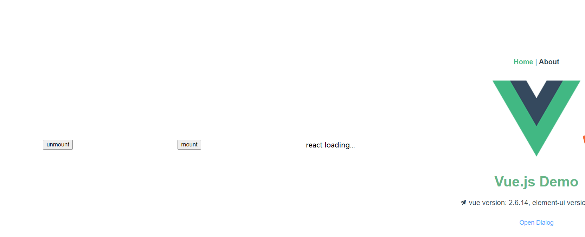
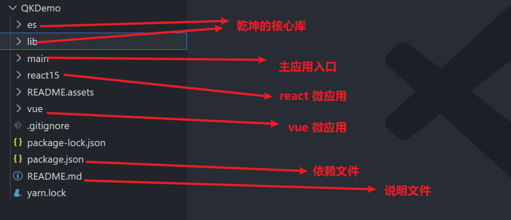
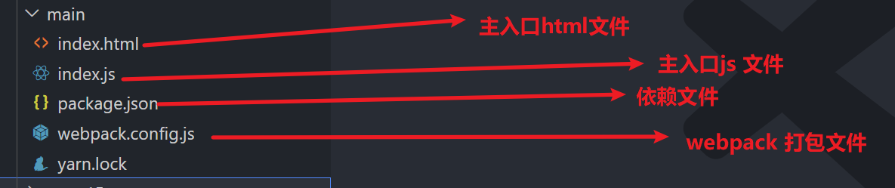

# 目标：了解什么是乾坤

# 乾坤介绍

qiankun 是一个基于 [single-spa](https://github.com/CanopyTax/single-spa) 的[微前端](https://micro-frontends.org/)实现库，旨在帮助大家能更简单、无痛的构建一个生产可用微前端架构系统。

qiankun 孵化自蚂蚁金融科技基于微前端架构的云产品统一接入平台，在经过一批线上应用的充分检验及打磨后，我们将其微前端内核抽取出来并开源，希望能同时帮助社区有类似需求的系统更方便的构建自己的微前端系统，同时也希望通过社区的帮助将 qiankun 打磨的更加成熟完善。

目前 qiankun 已在蚂蚁内部服务了超过 200+ 线上应用，在易用性及完备性上，绝对是值得信赖的。

# 目标：了解什么是微前端

> 微前端是一种多个团队通过独立发布功能的方式来共同构建现代化 web 应用的技术手段及方法策略。

微前端架构具备以下几个核心价值：

- 技术栈无关
  主框架不限制接入应用的技术栈，微应用具备完全自主权

- 独立开发、独立部署
  微应用仓库独立，前后端可独立开发，部署完成后主框架自动完成同步更新

- 增量升级

  在面对各种复杂场景时，我们通常很难对一个已经存在的系统做全量的技术栈升级或重构，而微前端是一种非常好的实施渐进式重构的手段和策略

- 独立运行时
  每个微应用之间状态隔离，运行时状态不共享

微前端架构旨在解决单体应用在一个相对长的时间跨度下，由于参与的人员、团队的增多、变迁，从一个普通应用演变成一个巨石应用([Frontend Monolith](https://www.youtube.com/watch?v=pU1gXA0rfwc))后，随之而来的应用不可维护的问题。这类问题在企业级 Web 应用中尤其常见。

# 目标：了解乾坤的特性

- 📦 **基于 [single-spa](https://github.com/CanopyTax/single-spa)** 封装，提供了更加开箱即用的 API。
- 📱 **技术栈无关**，任意技术栈的应用均可 使用/接入，不论是 React/Vue/Angular/JQuery 还是其他等框架。
- 💪 **HTML Entry 接入方式**，让你接入微应用像使用 iframe 一样简单。
- 🛡 **样式隔离**，确保微应用之间样式互相不干扰。
- 🧳 **JS 沙箱**，确保微应用之间 全局变量/事件 不冲突。
- ⚡️ **资源预加载**，在浏览器空闲时间预加载未打开的微应用资源，加速微应用打开速度。
- 🔌 **umi 插件**，提供了 [@umijs/plugin-qiankun](https://github.com/umijs/plugins/tree/master/packages/plugin-qiankun) 供 umi 应用一键切换成微前端架构系统。

# 目标：从 0 到 1 搭建一个微前端应用，[线上地址](https://gitee.com/thomaslwq/qkdemo)

## 克隆线上例子观看运行效果

1. 克隆线上代码

```bash
git clone https://gitee.com/thomaslwq/qkdemo.git
```

2. 进入项目目录，以此执行安装依赖命令然后执行

```bash
cd qkdemo
// 打开不同终端 依次运行以下命令
npm i
npm run install:father
npm run install:react16
npm run start:react16
npm run install:vue
npm run start:vue
npm run install:main
npm run start:main
```

3. 执行看到效果



## 目标：理解案例各个目录的作用



## 目标：了解微前端的主应用入口的文件目录和作用



## 目标：知道如何修改 React 项目成为一个乾坤微前端应用

以 `create react app` 生成的 `react 16` 项目为例，搭配 `react-router-dom` 5.x。

1. 在 `src` 目录新增 `public-path.js`：

   ```js
   if (window.__POWERED_BY_QIANKUN__) {
     __webpack_public_path__ = window.__INJECTED_PUBLIC_PATH_BY_QIANKUN__
   }
   ```

2. 设置 `history` 模式路由的 `base`：

   ```html
   <BrowserRouter basename={window.__POWERED_BY_QIANKUN__ ? '/app-react' : '/'}>
   ```

3. 入口文件 `index.js` 修改，为了避免根 id `#root` 与其他的 DOM 冲突，需要限制查找范围。

   ```js
   import './public-path'
   import React from 'react'
   import ReactDOM from 'react-dom'
   import App from './App'
   import * as serviceWorker from './serviceWorker'

   function render(props) {
     const { container } = props
     ReactDOM.render(
       <App />,
       container
         ? container.querySelector('#root')
         : document.querySelector('#root')
     )
   }

   function storeTest(props) {
     props.onGlobalStateChange(
       (value, prev) =>
         console.log(`[onGlobalStateChange - ${props.name}]:`, value, prev),
       true
     )
     props.setGlobalState({
       ignore: props.name,
       user: {
         name: props.name
       }
     })
   }

   if (!window.__POWERED_BY_QIANKUN__) {
     render({})
   }

   export async function bootstrap() {
     console.log('[react16] react app bootstraped')
   }

   export async function mount(props) {
     console.log('[react16] props from main framework', props)
     storeTest(props)
     render(props)
   }

   export async function unmount(props) {
     const { container } = props
     ReactDOM.unmountComponentAtNode(
       container
         ? container.querySelector('#root')
         : document.querySelector('#root')
     )
   }

   // If you want your app to work offline and load faster, you can change
   // unregister() to register() below. Note this comes with some pitfalls.
   // Learn more about service workers: https://bit.ly/CRA-PWA
   serviceWorker.unregister()
   ```

4. 修改 `webpack` 配置

   安装插件 `@rescripts/cli`，当然也可以选择其他的插件，例如 `react-app-rewired`。

   ```dash
   npm i -D @rescripts/cli
   ```

   根目录新增 `.rescriptsrc.js`：

   ```js
   const { name } = require('./package')

   module.exports = {
     webpack: (config) => {
       config.output.library = `${name}-[name]`
       config.output.libraryTarget = 'umd'
       config.output.jsonpFunction = `webpackJsonp_${name}`
       config.output.globalObject = 'window'

       return config
     },

     devServer: (_) => {
       const config = _

       config.headers = {
         'Access-Control-Allow-Origin': '*'
       }
       config.historyApiFallback = true
       config.hot = false
       config.watchContentBase = false
       config.liveReload = false

       return config
     }
   }
   ```

   修改 `package.json`：

   ```diff
   -   "start": "react-scripts start",
   +   "start": "rescripts start",
   -   "build": "react-scripts build",
   +   "build": "rescripts build",
   -   "test": "react-scripts test",
   +   "test": "rescripts test",
   -   "eject": "react-scripts eject"
   ```

## 目标：知道如何修改 Vue 项目为一个 微应用

以 `vue-cli 3+` 生成的 `vue 2.x` 项目为例，`vue 3` 版本等稳定后再补充。

1. 在 `src` 目录新增 `public-path.js`：

   ```js
   if (window.__POWERED_BY_QIANKUN__) {
     // eslint-disable-next-line no-undef
     __webpack_public_path__ = window.__INJECTED_PUBLIC_PATH_BY_QIANKUN__
   }
   ```

2. 入口文件 `main.js` 修改，为了避免根 id `#app` 与其他的 DOM 冲突，需要限制查找范围。

   ```js
   import './public-path'
   import Vue from 'vue'
   import VueRouter from 'vue-router'
   import App from './App.vue'
   import routes from './router'
   import store from './store'

   Vue.config.productionTip = false

   let router = null
   let instance = null
   function render(props = {}) {
     const { container } = props
     router = new VueRouter({
       base: window.__POWERED_BY_QIANKUN__ ? '/app-vue/' : '/',
       mode: 'history',
       routes
     })

     instance = new Vue({
       router,
       store,
       render: (h) => h(App)
     }).$mount(container ? container.querySelector('#app') : '#app')
   }

   // 独立运行时
   if (!window.__POWERED_BY_QIANKUN__) {
     render()
   }

   export async function bootstrap() {
     console.log('[vue] vue app bootstraped')
   }
   export async function mount(props) {
     console.log('[vue] props from main framework', props)
     render(props)
   }
   export async function unmount() {
     instance.$destroy()
     instance.$el.innerHTML = ''
     instance = null
     router = null
   }
   ```

3. 打包配置修改（`vue.config.js`）：

   ```js
   const { name } = require('./package')
   module.exports = {
     devServer: {
       headers: {
         'Access-Control-Allow-Origin': '*'
       }
     },
     configureWebpack: {
       output: {
         library: `${name}-[name]`,
         libraryTarget: 'umd', // 把微应用打包成 umd 库格式
         jsonpFunction: `webpackJsonp_${name}`
       }
     }
   }
   ```

###
